<p style="font-size: 0.9rem; color: var(--color-text-faint); margin-bottom: 1.75rem;"><a href="https://adpsagent.com/workshops/">Workshops</a><span style="margin: 0 0.45rem;">/</span>Collaboration</p>

<header class="publication-head">
<p class="publication-series">ADPS Design Pattern Workshop Series</p>
<h1>First Collaboration Module Workshop</h1>
<p class="publication-deck">Task, context, authority, evidence, and responsibility across multi-agent and human collaboration.</p>
</header>

<p class="publication-date">25 August 2026</p>

<table><tbody>
<tr><td><strong>Hosts</strong></td><td>Haili Zhang and Jia Huang</td></tr>
<tr><td><strong>Core workshop guests</strong></td><td>Dong Zhang and Wei Wang</td></tr>
</tbody></table>

The workshop used LangGraph, Deep Agents, and the collaboration patterns to discuss dynamic workflows, delegated authority, cross-session conflicts, hook composition, human collaboration, and the Agent OS analogy.

<figure><figcaption>The three relationships cover task handoffs, human authorization and takeover, and records of team decisions.</figcaption></figure>

## 1. Dynamic sub-agents can still be centrally orchestrated

A dynamic workflow may let a model interpret the task, select sub-agents, generate call steps, and pass them to an interpreter. The flow changes at runtime, but the interpreter still owns the current plan, call order, and result aggregation.

An order flow makes choreography concrete. A payment service publishes `PaymentConfirmed`. Inventory subscribes, reserves stock, and publishes `StockReserved`. Delivery and notification services subscribe to that new event and act under their own rules. No orchestrator stores the full payment-inventory-delivery-notification plan. By contrast, a model may select sub-agents at runtime while one interpreter still owns the plan, call order, and result aggregation; that remains dynamic orchestration. Runtime change is not the criterion. Ownership of the complete plan is. C6 therefore remains a candidate.

<figure class="workshop-diagram"><figcaption>Dynamic orchestration retains one plan owner; choreography advances through participant-local event rules.</figcaption></figure>

## 2. Six design topologies can lower to three runtime primitives

<p class="workshop-field-note">Dong Zhang observed that many runtime graphs reduce to serial execution, parallel execution, and routing. Node responsibilities still need separate definitions. In a lead-worker hierarchy, the lead owns the task and accepts the work; in generator-reviewer-adjudicator review, the reviewer checks the artifact and the adjudicator resolves disagreements.</p>

Hierarchical Delegation may execute as route, parallel workers, and gather. Adversarial Review may execute as generate, review, adjudicate, and conditional loop. Similar low-level edges still carry different ownership, acceptance, and failure responsibilities. ADPS calls this [topology lowering](https://adpsagent.com/concepts/topology-lowering/): preserve responsibility in design, then compile it into runtime primitives supported by the framework.

<figure><figcaption>Check node identity, resource permissions, validation points, and trace records for each runtime structure.</figcaption></figure>

## 3. Every topology needs four more checks

<p class="workshop-field-note"><strong>Dong Zhang applied identity, authority, safeguards, and provenance to each topology.</strong> A lead who may read the full batch does not imply that a worker verifying one record inherits that scope. A gather node may read every branch result without gaining authority to mutate source records.</p>

<table><thead><tr><th>Runtime structure</th><th>Identity</th><th>Authority</th><th>Safeguards</th><th>Provenance</th></tr></thead><tbody>
<tr><td>Serial</td><td>Principal at each hop</td><td>Scoped per leg and reclaimed</td><td>Gates stop error propagation</td><td>Linear responsibility chain</td></tr>
<tr><td>Parallel</td><td>Independent shard roles</td><td>Branch isolation; read-only gather</td><td>Branch checks plus global validation</td><td>One trace with child spans</td></tr>
<tr><td>Routing</td><td>Route matches identity and risk</td><td>Tighter scope on high-risk routes</td><td>Ingress filtering and differentiated controls</td><td>Route reason and full path</td></tr>
</tbody></table>

Effective authority is limited by user scope, task scope, agent role, tool permissions, and resource scope. If all workers share the user's long-lived token, each can acquire the user's full access, including workers assigned to verify just one record.

## 4. Versioning the graph for production

Development can allow coding agents to split work and try new branches under close review. In test, the main graph, agent roles, tools, and policies become versioned. Staging approaches production conditions. Production pins agent, model, tool, and policy versions while keeping only evaluated dynamic choices.

## 5. Collaboration has three planes

<p class="workshop-field-note">Wei Wang noted that decisions made by product, engineering, and test teams affect later agent work. If a rejected approach and the reason for rejecting it remain only in chat, the next agent reading the repository may propose it again.</p>

Agent-Agent collaboration covers decomposition, parallel work, hand-off, and review. Human-Agent collaboration covers intent, missing evidence, approval, takeover, and acceptance. Human-Human collaboration around the agent carries team decisions and responsibility over time.

The third plane often remains in meetings and chat. A later agent can read the repository but cannot see why a path was chosen. Decisions, evidence, and boundaries that affect future work belong in versioned assets such as RFCs, ADRs, and runbooks. Raw conversations do not need to be copied wholesale.

## 6. Worktrees do not isolate every conflict

<p class="workshop-field-note">Wei Wang encountered two sessions allocating the same requirement identifier while working in separate Git worktrees. Their files did not conflict, but the shared identifier allocation did.</p>

Separate worktrees isolate files, but concurrent sessions may still compete for requirement IDs, shared configuration, test databases, deployment environments, and external quotas. The scheduler must identify the [write-conflict domain](https://adpsagent.com/concepts/write-conflict-domain/) before launching parallel work.

## 7. A hand-off needs a contract

Conversation history rarely states which decisions are binding, which paths were rejected, what the next role may change, and how its work will be accepted.

<pre><code class="language-yaml">handoff_id: h_01K...
goal: preserve the compatibility interface
from_role: requirements-agent
to_role: implementation-agent
artifacts:
  - uri: artifact://spec/417
    version: sha256:...
decisions:
  - choice: keep the public schema
    evidence: adr://23
authority:
  allowed_tools: [repo_read, patch_write]
  resource_scope: repo://service-a
acceptance:
  checks: [unit_tests, contract_tests]</code></pre>

A [Handoff Contract](https://adpsagent.com/concepts/handoff-contract/) transfers goal, artifacts, decisions, authority, responsibility, and acceptance together. The receiver explicitly accepts or rejects the hand-off, and temporary authority from the previous leg is reclaimed.

## 8. Independent review creates its own gap

Separating generator and reviewer reduces self-review bias. Execution may then expose missing dependencies, version differences, or insufficient authority. Those facts must return to the review layer; otherwise the next run repeats an obsolete judgement.

## 9. Hook triggers and composition

<p class="workshop-field-note">Wei Wang asked whether hooks should form an independent collaboration pattern. Participants discussed starting a coding agent after requirements are complete, pausing before a dangerous call for approval, recording a trace after a call, and saving a checkpoint on failure. These uses belong to orchestration, governance, observation, and recovery respectively; the same callback mechanism serves different designs.</p>

No C7 was added. G5 keeps its historical identifier for deterministic governance enforcement. Cross-module use is documented in the [Hook Composition](https://adpsagent.com/topics/hook-composition/) topic.

## 10. Probabilistic core, deterministic shell

```
ambiguous goal → model interpretation and candidates → structured intent
              → rules / state / authority / tests → controlled action → external result
```

Models handle open-ended understanding, planning, and candidate generation. Identity, money, resources, state transitions, idempotency, tests, and receipts require reproducible mechanisms. The shell protects boundaries that cannot be carried by probability.

## 11. Agent OS is an engineering checklist

<p class="workshop-field-note">Dong Zhang discussed processes, threads, coroutines, and IPC as references for multi-agent runtimes. Haili Zhang described service-based sub-agents, standard protocols, and virtual file systems. They suggest concrete design questions: who schedules tasks, how environments are isolated, how agents communicate, and where artifacts are stored.</p>

Identity, observability, resource reclamation, and failure handling also need assigned components. An operating-system process has defined resource and isolation rules, whereas an agent may call models and tools across several services. Its actual runtime boundaries need to be specified rather than assumed to match a process.

## 12. Abstract, then reconstruct

<p class="workshop-field-note">Jia Huang compared processing eight hundred résumés with processing eight hundred code files. Both jobs can use parallel shards. Résumé processing needs candidate-data access limits and hiring decisions by a responsible person; code processing needs worktree isolation, tests, and repository merge controls. The parallel structure is shared, but authorization and acceptance differ.</p>

Abstraction extracts the shared split-execute-gather structure. Reconstruction specifies what each worker can read and change, and who checks its result. Differences affecting business decisions, state changes, authority, evidence, responsibility, or acceptance must remain explicit in that design.

## Resulting revisions

1. A new [Collaboration module overview](https://adpsagent.com/patterns/collaboration/) separates relationship patterns, constraints, distributed candidates, and implementation mechanisms.
2. C1-C5 now cover task identities, write-conflict domains, review feedback, Handoff Contracts, and cross-session isolation.
3. C6 distinguishes dynamic orchestration from choreography and remains a candidate.
4. G5 retains its identifier; cross-module hook composition moves to a topic.
5. G4 remains a legacy catalog entry that leads to X1 Observability.

## Open questions

- How should design intent survive topology lowering into a runtime graph?
- Which Handoff Contract fields can remain stable across frameworks?
- How can a scheduler discover cross-session write-conflict domains before execution?
- How should hook composition expose order, idempotency, and failure semantics?
- Where does the Agent OS analogy predict useful architecture, and where does it distort it?

## Related pages

- [Collaboration module overview](https://adpsagent.com/patterns/collaboration/)
- [Human-Agent collaboration boundaries](https://adpsagent.com/topics/human-agent-interaction/)
- [Hook Composition](https://adpsagent.com/topics/hook-composition/)
- [Abstraction and Reconstruction](https://adpsagent.com/topics/abstraction-reconstruction/)
- [Agent OS engineering checklist](https://adpsagent.com/topics/agent-os-engineering/)

<p class="publication-note publication-note-end">Based on the 25 August 2026 workshop transcript. Internal project details have been anonymized.</p>

<!-- RELATED-CASE-DEEPAGENTS:START -->

<section aria-labelledby="related-deepagents-case" class="related-case-band">
<p class="related-case-label">Related open-source framework case</p>
<h2 id="related-deepagents-case"><a href="https://adpsagent.com/cases/deepagents-dynamic-orchestration/">Deep Agents: From Fixed Graphs to Code-Generated Collaboration</a></h2>
<p>Haili Zhang's workshop research, checked against public documentation and source code, connects hierarchical delegation, fan-out/gather, subagent isolation, independent verification, evaluation, and observability.</p>
</section>

<!-- RELATED-CASE-DEEPAGENTS:END -->

<!-- PAGE-CHRONICLE:START -->

<section aria-labelledby="page-chronicle-title" class="page-chronicle">
<h2 id="page-chronicle-title">Chronicle</h2>
<dl>
<div><dt>Recorded source</dt><dd>First Collaboration Module Workshop; workshop held on <time datetime="2026-08-25">2026-08-25</time></dd></div>
<div><dt>Source date</dt><dd><time datetime="2026-08-25">2026-08-25</time></dd></div>
<div><dt>First published on ADPS</dt><dd><time datetime="2026-08-26">2026-08-26</time></dd></div>
</dl>
<p><a href="https://adpsagent.com/chronicle/#workshops-collaboration-2026-08-25">View in the ADPS Chronicle</a></p>
</section>

<!-- PAGE-CHRONICLE:END -->
