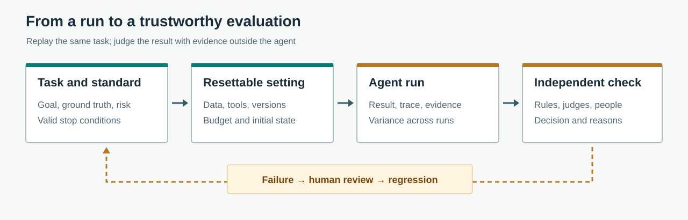

<a href="https://adpsagent.com/workshops/">Workshops</a>/Cross-cutting engineering · Evaluation and validation

<header class="publication-head">

ADPS Design Pattern Workshop Series

<h1>Agent Evaluation and Validation Workshop</h1>

Task completion, business correctness, repeated runs, and the evidence needed to release a new version.

</header>

29 September 2026

<table class="workshop-roster"><thead><tr><th>Role</th><th>Name</th><th>Public role</th></tr></thead><tbody>
<tr><td>Host</td><td>Jia Huang</td><td>ADPS co-founder; author of Manning's <em>Designing AI Agents</em></td></tr>
<tr><td>Host</td><td>Fei Gao</td><td>Technical lead of software-testing agent AUUO.ai; formerly an architect at Kuaishou and iQIYI</td></tr>
<tr><td>Speaker</td><td>Likun Zhao</td><td>Quality expert, Ant Group's Alipay technology division</td></tr>
<tr><td>Speaker</td><td>Dong Zhang</td><td>Expert engineer at Tencent; head of Wukong R&amp;D security</td></tr>
<tr><td>Speaker</td><td>Xianglong Huang</td><td>Founder of Beijing Weinian Intelligent; author of OpenLogos and RunLogos</td></tr>
<tr><td>Speaker</td><td>Haili Zhang</td><td>Author of <em>LangGraph in Practice</em> and <em>LangChain in Practice</em>; LangChain Ambassador</td></tr>
<tr><td>Speaker</td><td>Bo Li</td><td>Senior engineer and chief engineer at a planning and design institute</td></tr>
<tr><td>Organizer</td><td>Pingping Bai</td><td>ADPS secretary; organizer of AI R&amp;D conferences</td></tr>
</tbody></table>

The discussion lasted just over two hours and twenty minutes. Fei Gao began with evaluation tasks and environments, then described GUI testing on vehicle displays. Likun Zhao discussed business-specific datasets and model judges. Dong Zhang connected repeated-run stability to production releases. Xianglong Huang opened up the test ledger and multi-model review process behind AI-assisted software development. Bo Li showed why, in engineering drawing review, the right answer can be to stop and ask for missing source material.

## 1. What, exactly, is being evaluated?

Jia Huang opened with three settings. In AI-assisted software development, tests must check both implementation and the independently agreed requirements. For a reusable agent product, one successful run says little about other tasks or later versions. In AI-assisted drug research, a completed calculation produces a candidate finding; it does not settle the scientific question. Each setting needs a different test subject and a different authority for the final judgment.

<figure class="workshop-diagram"><figcaption>Opening slide (Chinese): implementation changes and acceptance criteria should not approve each other. Open the image at full size.</figcaption></figure>

<figure class="workshop-diagram"><figcaption>GIS publishing: an HTTP 200 response, a loaded page, and a correct map are three separate checks. The setting comes from an existing GIS case.</figcaption></figure>

<figure class="workshop-diagram"><figcaption>Research: when two predictions disagree, another calculation is useful only if it helps rule out a wrong candidate.</figcaption></figure>

An agent's own answer is not an independent measure of its quality. The team also needs business facts, a task it can replay, and a judge whose errors can be checked.

## 2. Fei Gao: build the task, environment, and verifier

Fei distinguished public leaderboards from product-specific tests. He discussed <a href="https://github.com/open-compass/AgentCompass">AgentCompass</a>, which separates benchmarks, harnesses, models, and environments, and <a href="https://github.com/harbor-framework/harbor">Harbor</a>, which structures task execution and verification. These tools make repeated runs practical, but they do not decide what a particular product ought to do. He used <a href="https://github.com/swe-bench/SWE-bench">SWE-bench</a> to illustrate a task with a repository issue, a patch, and executable tests. A research report or GUI task also needs checks on citations, interface state, and intermediate actions.

His vehicle-display work made the distinction concrete. Some devices cannot be controlled through a debugging interface. A testing agent reads a camera image and operates the screen through a robotic arm. When the vehicle interface changes, the team collects images of the new icons and screens, labels samples, and tests recognition and action again. An early version observed the screen after every character typed. It could enter text, but took too long to be useful; batching part of the keyboard sequence improved the test workflow. Evaluation exposed a latency problem that a simple pass/fail result missed.

Jia asked how to compare outputs such as reports and websites, where there is no single reference answer. Fei started with the intended product task, then separated executable behavior, required content, citation validity, and other qualities into checks. Failed runs should also record where the task stopped. A capable runner cannot compensate for acceptance criteria the team has never written down.

## 3. Likun Zhao: business datasets are not interchangeable

Likun described agents used in consumer, merchant, and internal operations settings. Functionality, latency, and time to first token remain conventional software tests. Whether an answer serves the business calls for a domain-specific dataset and scoring rules. Her examples of dataset inputs included manually constructed questions, real user requests, production failures, and synthetic questions. The right sample count depends on the task rather than a universal target.

For product classification, people can label a reference set, while another model scores a larger batch. Cases where the model judge and people disagree become calibration material: the team checks the sample, rubric, and judge prompt. A judge model is not an authoritative oracle simply because it produces a score. Shared platform teams can provide horizontal checks, such as safety and multi-turn behavior, while product teams maintain their own cases and metrics.

Jia also asked how a company manages many separately built agents. Likun described a shared platform with team-level management. She was careful about outcomes: consumer-facing work was still difficult to assess in the aggregate, while some business-facing assistance had shown useful efficiency gains. A high agent count should not be reported as an equivalent business return.

## 4. Dong Zhang: start end to end, then open the failing stage

Dong began with a business scenario. In security testing, a team can first cover the common, high-impact categories, set a release threshold, and add new failure cases from production. Recall asks how many genuine problems were found; precision asks how many reported findings were real. Other domains need different measures. A generic benchmark cannot replace local acceptance criteria.

His use of “black box” did not mean deleting traces. Evaluate the full task first. If it meets the agreed outcome, there may be little value in scoring every internal step. If it fails, split the work into stages and locate the loss of evidence or incorrect decision. Fei pressed him on metrics tied to real tasks. Dong added **stability across repeated runs**: with the same task, model, prompt, and harness, a vulnerability may appear in one run and disappear in another. A single accuracy number hides that variance. A new model version also requires rerunning old cases; newer is not automatically better in every business scenario.

For production changes, Dong drew a firm boundary. Agents may draft tests, analyze failures, and propose rule updates in development. A change that directly affects customer traffic or security enforcement still needs a person to review the evidence and authorize release. Cross-model checks can reveal blind spots, but they do not take responsibility for production decisions.

## 5. Xianglong Huang: test the test machinery too

Xianglong described the OpenLogos and RunLogos workflow. A requirement becomes scenarios and test cases; code and test results retain the case IDs. Each run writes a structured ledger so acceptance can check every ID. A long task is delivered in smaller slices, each tested before the next one, followed by a complete regression. A failed test or broken ledger stops the flow for human attention.

He uses one model to implement and another to review. A review finding needs a code location, severity, and evidence. The implementer must answer whether it fixed, rejected, or deferred each finding. Without a limit, the reviewers can keep producing smaller objections indefinitely, so the process distinguishes discovery from convergence and escalates unresolved high-risk issues to a person.

The failure mode he emphasized was overdesign. An agent may write plausible new code without reading existing mechanisms closely enough, creating another cache, event source, or rate limiter. Review therefore asks whether the behavior already exists and points to the code that can be reused. Even the original mechanism should be reconsidered when a fix adds another one. Xianglong also warned that test code, ledgers, and evaluation rules are software and can be wrong themselves. As the suite grows, a full run after every small edit becomes expensive; selective and parallel regression require their own design.

## 6. Bo Li: in drawing review, stopping may be correct

Bo approached the question from a planning and design institute. He first built assistance for one discipline, then worked toward cross-discipline review in which engineers inspect the same project facts and reconcile conflicting comments. He does not apply a single automation rate to every task. Higher-risk decisions remain with people; lower-risk document checks and rule prompts can be automated more readily.

His example was a large project's drawing review. If a prerequisite geotechnical report is missing, the correct behavior is to stop formal review, identify what is missing, and wait for the document. Producing a confident review without it would be a failure, even if the output looked complete. Evaluation also changes as the system grows: a Skill is judged by whether it helps an engineer work, a single-discipline agent by its task result, and multiple agents by the consistency of their joint review. Bo argued for keeping real project cases in the test set so the system does not merely learn a fixed exam. For some drawing tasks, he finds images and PDFs more workable model inputs than direct CAD/BIM files; input format is part of the design being evaluated.

## 7. Checks to carry into an evaluation plan

<figure class="workshop-diagram"><figcaption>Synthesis of the workshop discussion, not a screenshot of any speaker's system. Open the full-size diagram.</figcaption></figure>

<table class="evaluation-checklist"><thead><tr><th>Decision</th><th>Question to answer</th></tr></thead><tbody>
<tr><td>Task and outcome</td><td>Whose task is it? What counts as a correct result, a justified stop, or an unacceptable risk?</td></tr>
<tr><td>Run conditions</td><td>Can the data, environment, model, harness, tools, and budget be recorded and replayed?</td></tr>
<tr><td>Judge</td><td>Which checks belong to code, domain rules, model judges, and people? How is a judge calibrated?</td></tr>
<tr><td>Version comparison</td><td>When one main variable changes, what happens to quality, repeatability, cost, and latency?</td></tr>
<tr><td>Release and regression</td><td>Which failures become test cases? Which production changes need human approval?</td></tr>
</tbody></table>

Haili Zhang added a framework distinction during the Q&amp;A. Organizing existing coding agents and building an agent product on a framework such as LangGraph are different development paths, with different runtime observation points. Both still need an explicit task, environment, and verification rule. A full framework comparison was deferred to a separate discussion.

## 8. Where this fits in ADPS

- [X2 Evaluation and Validation](https://adpsagent.com/patterns/x2-evals-and-testing/) contains the cross-cutting engineering requirements. This workshop adds business ground truth, judge calibration, repeated-run stability, tests of the evaluation machinery, and human release gates.
- The [Agent Evals and Testing topic](https://adpsagent.com/topics/agent-evals-and-testing/) can hold deeper, domain-specific tasks and verifier designs; this record preserves the exchange that motivated them.
- The [GIS publishing case](https://adpsagent.com/cases/xuanxu-gis-agent/) gives the project context for an API that succeeds while the visible map is wrong. The [Reflection module](https://adpsagent.com/patterns/reflection/) covers what happens to failures after a run.

The workshop did not settle how to reset a long-running interrupted task, how to measure the quality of multiple model reviewers, or who approves changes to a business test set. Those questions need further case work.

<figure class="workshop-diagram"><figcaption>Closing opening slide (Chinese): fixing one failure is not proof that the agent can handle the next kind of task. Keep the case and its acceptance rule in regression.</figcaption></figure>

Based on the 29 September 2026 meeting transcript. Internal implementation details have been anonymized. The original Chinese opening slides are from Jia Huang's v0.4 deck; the additional diagram was prepared after the workshop.

<!-- PAGE-CHRONICLE:START -->
<section aria-labelledby="page-chronicle-title" class="page-chronicle">
<h2 id="page-chronicle-title">Source record</h2>
<dl>

<dt>Source</dt><dd>Agent Evaluation and Validation workshop, <time datetime="2026-09-29">29 September 2026</time></dd>

<dt>Source date</dt><dd><time datetime="2026-09-29">29 September 2026</time></dd>

<dt>First published</dt><dd><time datetime="2026-10-01">1 October 2026</time></dd>

</dl>

<a href="https://adpsagent.com/chronicle/">ADPS source timeline</a>

</section>
<!-- PAGE-CHRONICLE:END -->
