<a href="https://adpsagent.com/workshops/">Workshops</a>/Reflection

<header class="publication-head">

ADPS Agent Design Pattern Workshop Series

<h1>ADPS Design Pattern Series: First Reflection Module Workshop</h1>

Online and offline reflection, feedback latency, evaluation evidence, skill evolution, attribution, and self-repair boundaries.

<time datetime="2026-08-12">2026-08-12</time>

</header>

<table>
<thead>
<tr>
<th style="text-align: left;"></th>
<th style="text-align: left;"></th>
</tr>
</thead>
<tbody>
<tr>
<td style="text-align: left;"><strong>Hosts</strong></td>
<td style="text-align: left;">Haili Zhang and Jia Huang</td>
</tr>
<tr>
<td style="text-align: left;"><strong>Core workshop guests</strong></td>
<td style="text-align: left;">Dong Zhang, Mo Zhou, Wei Wang, Qianchun Lu, Pylon Peng, and Jiaqi Li</td>
</tr>
</tbody>
</table>

ADPS held its first Reflection Module workshop on 12 August 2026. Participants brought production experience from R&D security, retail algorithms, quality evaluation, telecom knowledge engineering, software development, and travel services. The discussion began with in-application Generator-Critic loops and moved into offline evaluation, Skill evolution, attribution, self-heal authority, and delayed business feedback.

## 1. In-process reflection and out-of-process evaluation

Inside an application, rubrics and graders check the current artifact, and a revision loop corrects it. Outside the application, teams use datasets, evaluators, and execution traces to compare versions, check for broken functionality, and compare grader decisions with human judgments.

The same grader can serve both uses. Evaluation records the check result; reflection proposes or applies a change, followed by rerunning the relevant tasks to check its effect.

The White Paper now records this boundary in the [Reflection Module Overview](https://adpsagent.com/patterns/reflection/).

<figure class="workshop-diagram"><figcaption>Immediate and delayed feedback link to the same run; attribution precedes change, evaluation, and release.</figcaption></figure>

## 2. Online reflection fixes the current run; offline reflection fixes the system

Wei Wang described an environment-building agent that added a patch for each new failure. He observed improved stability over two months, but setup time grew from about five minutes to thirty, with some runs taking an hour. Daily analysis of run records exposed duplicate and conflicting constraints among dozens of patches.

Online reflection follows the current run and reacts to tool errors, invalid arguments, or incomplete artifacts. Offline reflection examines a period of trajectories and looks for repeated, conflicting, or systemic behaviour across runs.

Offline review should identify patches for the same failure and conflicting constraints, then compare setup success and duration after consolidating them. Online repairs need change records and a rollback method.

## 3. Feedback delay determines loop length

<strong>Li Jiaqi contrasted code with business analysis.</strong> Compilation, tests, and deployment logs can arrive immediately for code. A business recommendation may pass through product, operations, analysts, supply chain, and user behaviour before anyone knows whether it worked. The latter still has a feedback loop; it cannot fit inside the current session.

While a business result is pending, the system can check the recommendation's format, references, and known contradictions. When the result arrives, link it to the recommendation and agent version so business reviewers can assess its effect and other factors that influenced the outcome.

The workshop recorded immediate/delayed feedback and closed/open tasks as related but non-equivalent dimensions. Open-ended work may contain hard local checks, while the final user experience of a closed task may still arrive later.

## 4. Reflection needs hard evidence and a stopping rule

The workshop discussed four implementation responsibilities in a reflection workflow:

1. Hard validation gives priority to machine-verifiable signals.
2. Model diagnosis inspects artifacts and trajectories.
3. Memory and asset admission determines what may affect later runs.
4. Scheduling and control owns activation, rounds, cost, degradation, and human hand-off.

The White Paper adopts this structure and narrows the reuse condition. A one-run correction may be deliberately discarded. Any result that will affect later runs needs admission, versioning, and retirement.

The discussion also covered experiments in meta-reflection, deliberative reflection, and knowledge-completeness checks. They may help high-risk tasks without deterministic truth, but they remain exploratory and have not been added as formal patterns.

## 5. Three environments move bad cases out of production

Development, evaluation, and production require separate environments. Development permits close human-agent interaction. Evaluation runs a candidate rule or version against benchmarks. Production uses validated flows and assets.

When a bad case appears in production, the team keeps the production path stable, adds the failure to an evaluation set, produces candidate rule or knowledge changes, runs regressions, and promotes the new version through the environments. A reflection that changes shared assets or production policy should therefore enter an offline release process.

## 6. Attribution is a separate engineering step before healing

Qianchun Lu proposed organizing observation around runtime, execution, business outcomes, and user experience. Failed model calls need interface and error records; missing steps need execution traces; unmet goals need comparison with business requirements. Missing domain knowledge or conflicting team decisions require the relevant people to supply information or decide.

Reliability governance for organizational Agents and Skills connects pre-release admission and inspection, runtime health checks and circuit breaking, and post-run trace review, remediation, and re-testing. Instrumentation, failure classes, and evaluation can also be expressed as shared primitives across Agents and Skills.

Root causes need at least two classes. Invalid tool arguments, missing steps, and network instability may have direct remedies. Missing domain knowledge, changed business rules, and different team expectations exceed the original agent's authority. A diagnosis may also be a false positive or identify a problem that has no authorised automatic repair.

This discussion tightened F4 Self-Heal Loop: it requires an identifiable failure, an executable repair, independent verification, and rollback. Knowledge, business decisions, and responsibility boundaries require human intervention.

## 7. Skill evolution must address creation, comparison, and coexistence

Wei Wang described managing thousands of Skills. A Skill can pass alone but trigger incorrectly, capture another Skill's route, or conflict with an existing workflow when loaded alongside dozens of others. Tests need to cover both individual Skills and deployed combinations, distinguishing agent behavior, Skill content, and routing decisions.

Pylon Peng described a daily reflection process. A main agent evaluates sub-agent results; a post-run hook collects trajectories to propose changes to memory, Skills, rules, sub-agents, or the harness. Changes to tool arguments or business rules also update Skill documentation and validation cases. Proposed changes pass independent evaluation before release.

This daily batch process provides an implementation bridge between F2 Skill Package and F3 Experience Replay. Automatically generated assets still pass evaluation and a release gate before receiving durable authority.

## 8. Cross-model review can expose some shared blind spots

In an anonymized SQL generation and review system, some defects passed through when similar models generated and reviewed the SQL. Separating generation and review across models improved defect discovery in that setting.

Two models using the same incomplete rubric can still miss the same error. Cross-model review results need comparison with tests, business rules, source material, and expert judgments.

## 9. Concepts extracted from the workshop

<table>
<thead>
<tr>
<th style="text-align: left;">Concept</th>
<th style="text-align: left;">Workshop definition</th>
<th style="text-align: left;">Current status</th>
</tr>
</thead>
<tbody>
<tr>
<td style="text-align: left;"><strong>Reflection Contract</strong></td>
<td style="text-align: left;">Make trigger, evidence, judging policy, change scope, authority, budget, verification, and retention inspectable</td>
<td style="text-align: left;">Added to the reflection overview</td>
</tr>
<tr>
<td style="text-align: left;"><strong>Two feedback clocks</strong></td>
<td style="text-align: left;">Online loops consume immediate signals for the current run; offline loops consume cross-task and delayed outcomes</td>
<td style="text-align: left;">Operating mode, not a new pattern coordinate</td>
</tr>
<tr>
<td style="text-align: left;"><strong>Patch debt</strong></td>
<td style="text-align: left;">Local online fixes accumulate into duplicate, conflicting, or unnecessarily long paths</td>
<td style="text-align: left;">Important input to F3 offline replay</td>
</tr>
<tr>
<td style="text-align: left;"><strong>Change authority</strong></td>
<td style="text-align: left;">Define which objects reflection may recommend or modify and when a release gate is required</td>
<td style="text-align: left;">Shared reflection and governance field</td>
</tr>
<tr>
<td style="text-align: left;"><strong>Attribution before healing</strong></td>
<td style="text-align: left;">Establish failure class, responsibility boundary, and repairable target before automatic modification</td>
<td style="text-align: left;">Added to the F4 boundary</td>
</tr>
</tbody>
</table>

## 10. Changes entering the White Paper

1. Add a bilingual [Reflection Module Overview](https://adpsagent.com/patterns/reflection/) defining the boundary among observability, evaluation, reflection, and release governance.
2. Record **online reflection** and **offline reflection** as operating modes, without adding pattern numbers.
3. Extend **F1 Generator-Critic** with reflection contracts, trajectory review, critic calibration, and multi-dimensional rubric trade-offs.
4. Extend **F2 Skill Package** with candidate, isolated evaluation, coexistence evaluation, canary, version, and retirement stages.
5. Extend **F3 Experience Replay** with offline trace mining, delayed feedback, and consolidation of local patches.
6. Tighten **F4 Self-Heal Loop** by separating repairable runtime failures from missing knowledge and changed business logic.
7. Keep meta-reflection, deliberative reflection, and prospective reflection as research directions rather than formal patterns.

## 11. Open questions

- How should online change authority be tiered by task risk?
- How can a delayed business outcome be attributed to the exact agent version and trajectory that produced it?
- Which metrics should be common to isolated and combined Skill evaluation?
- Who owns admission and rollback when reflection changes memory, a Skill, or the harness?
- What reproducible cost and quality evidence would justify cataloguing meta-reflection, deliberative reflection, or knowledge-completeness checks?

## Related pages

- [Reflection Module Overview](https://adpsagent.com/patterns/reflection/)
- [F1 Generator-Critic](https://adpsagent.com/patterns/f1-generator-critic/)
- [F2 Skill Package](https://adpsagent.com/patterns/f2-skill-package/)
- [F3 Experience Replay](https://adpsagent.com/patterns/f3-experience-replay/)
- [F4 Self-Heal Loop](https://adpsagent.com/patterns/f4-self-heal-loop/)
- [White Paper contributors](https://adpsagent.com/founders/#white-paper-contributors)

Based on the 12 August 2026 workshop transcript. Internal project details have been anonymized.

<!-- PAGE-CHRONICLE:START -->

<section aria-labelledby="page-chronicle-title" class="page-chronicle">
<h2 id="page-chronicle-title">Chronicle</h2>
<dl>

<dt>Recorded source</dt><dd>ADPS Design Pattern Series: First Reflection Module Workshop; workshop held on <time datetime="2026-08-12">2026-08-12</time></dd>

<dt>Source date</dt><dd><time datetime="2026-08-12">2026-08-12</time></dd>

<dt>First published on ADPS</dt><dd><time datetime="2026-08-13">2026-08-13</time></dd>

</dl>

<a href="https://adpsagent.com/chronicle/#workshops-reflection-2026-08-12">View in the ADPS Chronicle</a>

</section>

<!-- PAGE-CHRONICLE:END -->
