<p style="font-size: 0.9rem; color: var(--color-text-faint); margin-bottom: 1.75rem;"><a href="https://adpsagent.com/zh/workshops/">研讨会</a><span style="margin: 0 0.45rem;">/</span>协作 Collaboration</p>

<header class="publication-head">
<p class="publication-series">ADPS 设计模式系列研讨会</p>
<h1>协作模块第一次研讨会</h1>
<p class="publication-deck">多 Agent 的任务分派、权限传递、跨 Session 冲突与团队决策。</p>
</header>

<p class="publication-date">2026-08-25</p>

<table><tbody>
<tr><td><strong>主持人</strong></td><td>张海立、黄佳</td></tr>
<tr><td><strong>核心研讨嘉宾</strong></td><td>张栋、王伟</td></tr>
</tbody></table>

本次研讨结合 LangGraph、Deep Agents 和协作模式，讨论动态工作流、权限传递、跨 Session 冲突、Hook 编排、人机关系及 Agent OS。

<figure><figcaption>三类协作关系分别涉及任务交接、人的授权与接管、团队决定的记录。</figcaption></figure>

## 1. 动态子 Agent 仍可能是中心编排

开场展示的动态工作流由模型理解任务、选择子 Agent、生成调用步骤，再交给解释器执行。流程没有预先写死，控制权仍集中在解释器所在的 Orchestrator：它持有当前计划、调用顺序和结果收口。

编舞可以用一条订单链看清楚。支付服务发布 `PaymentConfirmed`；库存服务订阅后预留库存，再发布 `StockReserved`；物流和通知服务各自订阅这个新事件并行动。每个参与者只掌握本地规则，没有一个 Orchestrator 保存“付款—库存—物流—通知”的完整计划。相反，模型即使在运行时临时选择子 Agent，只要仍由一个解释器保存计划、决定调用顺序并汇总结果，它就是动态编排。流程会不会变化不是判据，完整计划由谁持有才是判据。C6 因此继续保持候选地位。

<figure class="workshop-diagram"><figcaption>动态编排仍由一个节点持有完整计划；编舞由参与者根据事件和本地规则推进。</figcaption></figure>

## 2. 六种设计拓扑怎样落到运行图

<p class="workshop-field-note">张栋提出，许多运行图最终都能拆成串行、并行和路由。不过，图中节点的职责仍需单独说明：“负责人分派—Worker 执行—负责人验收”中的负责人掌握整个任务；“生成者—评审者—裁决者”中的评审者检查产物，裁决者处理分歧。</p>

层级委派可以执行成“路由任务—并行 Worker—聚合结果”；对抗评审可以执行成“生成—评审—裁决—条件回路”。底层边相似，谁持有全局状态、谁负责验收、失败后由谁收口并不相同。ADPS 将这一步称为[拓扑降阶](https://adpsagent.com/zh/concepts/topology-lowering/)：设计时保留责任语义，部署时编译为框架支持的运行原语。

<figure><figcaption>按运行结构检查节点身份、资源权限、校验位置和追踪记录。</figcaption></figure>

## 3. 每一种拓扑都要再过四层检查

<p class="workshop-field-note"><strong>张栋随后把拓扑与身份、权限、防护和溯源交叉检查。</strong>例如负责人有权读取整批数据，不代表核验单条记录的 Worker 应继承同样范围；聚合节点需要读所有分支结果，也不因此获得修改源记录的权力。</p>

<table><thead><tr><th>运行结构</th><th>身份</th><th>权限</th><th>防护与质控</th><th>溯源</th></tr></thead><tbody>
<tr><td>串行</td><td>每一跳说明代表关系</td><td>逐段授权，交接后回收</td><td>节点门禁阻止错误下传</td><td>线性责任链与前后状态</td></tr>
<tr><td>并行</td><td>分片角色与责任域独立</td><td>分支隔离，聚合默认只读</td><td>分支校验，汇聚总检</td><td>统一 trace ID 与子链路</td></tr>
<tr><td>路由</td><td>身份与风险等级匹配</td><td>高风险分支收紧权限</td><td>入口筛选与差异控制</td><td>路由依据与完整路径</td></tr>
</tbody></table>

有效权限需要同时受用户权限、本次任务、Agent 职责、工具权限与资源范围限制。如果整条协作链共享用户的长期 Token，每个 Worker 都可能取得用户的全部权限，单条记录的核验也就无法限制在这条记录内。

## 4. 越接近生产，拓扑越需要固定

开发环境允许 Coding Agent 临时拆任务、生成分支并快速试错。进入测试以后，主要 graph、Agent 角色、工具和策略开始版本化；预发布使用更接近真实的环境与数据边界；生产固定 Agent、模型、工具与策略版本，只在已经评测的范围内保留动态决策。

开放探索适合开发和低风险判断。真实业务需要可复现、可回归和可回滚的运行结构。模型、Prompt、Harness 或工具换版后，旧评测结论不能自动继承。

## 5. 协作对象不止 Agent 与 Agent

<p class="workshop-field-note">王伟指出，产品、研发和测试在会议中形成的决定，也会影响 Agent 的后续工作。某个方案已经被团队否决，但原因只留在聊天中，下一轮 Agent 读取代码库时就可能再次提出它。</p>

讨论把协作分为三个平面：Agent-Agent 处理拆分、并行、交接与复核；Human-Agent 处理意图、补证、批准、接管与验收；Human-Human 处理 Agent 环境中的团队决定与责任延续。

第三个平面经常留在会议和聊天里。代码库只保留最后结果，下一轮 Agent 看不到选择这条路径的理由。会影响后续判断的决定、证据和边界，应进入 RFC、ADR、runbook 或其他版本化资产。原始聊天无需整段搬进仓库。

## 6. Worktree 隔离不了所有冲突

<p class="workshop-field-note">王伟遇到过两个 Session 在不同 worktree 中工作，却申请了同一个需求编号的情况。文件没有冲突，共享的编号分配却发生了冲突。</p>

除了编号，公共配置、测试数据库、部署环境和外部配额也可能由多个 Session 共享。调度器需要在启动前识别[写入冲突域](https://adpsagent.com/zh/concepts/write-conflict-domain/)：即使改动不同仓库，只要共同改变同一个 API 合同，仍然可能冲突。

领域对象比文件路径更能说明互斥关系。范围识别不清时先串行，确定可分片后再并行。

## 7. 交接需要合同

把完整 conversation history 交给下一位 Agent，看似信息充分，通常没有说明哪些决定已经确定、哪些路径已经否决、下一棒能改变什么、用什么标准验收。

<pre><code class="language-yaml">handoff_id: h_01K...
goal: 保持兼容接口，完成服务端修改
from_role: requirements-agent
to_role: implementation-agent
artifacts:
  - uri: artifact://spec/417
    version: sha256:...
decisions:
  - choice: 不改公共 schema
    evidence: adr://23
authority:
  allowed_tools: [repo_read, patch_write]
  resource_scope: repo://service-a
acceptance:
  checks: [unit_tests, contract_tests]
next_required: 可评审补丁与测试证据</code></pre>

[交接合同](https://adpsagent.com/zh/concepts/handoff-contract/)共同传递目标、产物、决定、权限、责任和验收。接收方显式接受或拒绝，上一段的临时权限按策略回收。

## 8. 独立评审也会产生断层

生成者与评审者分开，可以减少自评偏好。执行者真正动手时，可能发现依赖不存在、接口版本不同或资源权限不足。若这些事实没有返回评审层，下一轮仍会沿用旧判断。

评审产物需要带上依据、风险、适用条件和复验要求。C3 对抗评审与 C4 交接链在这里连接：评审给出条件，交接传递条件，执行结果再回到外部验收。

## 9. Hook 的触发条件与组合

<p class="workshop-field-note">王伟问，Hook 是否应该作为独立协作模式？讨论涉及几种用途：需求完成后启动编码 Agent；高危调用前暂停并等待审批；调用后记录 trace；失败后保存 checkpoint。这些用途分别属于编排、治理、观测和恢复，同一种回调机制可以用于不同的设计。</p>

本轮没有新增 C7。G5 继续保留历史编号，用于治理中的确定性执行点；跨模块的 Hook 用法进入[Hook 组合](https://adpsagent.com/zh/topics/hook-composition/)专题。组合设计必须声明事件、顺序、条件、幂等键、失败语义与后续事件，避免把控制流藏进互不透明的回调。

## 10. 概率内核与确定性外壳

```
模糊目标 → 模型理解与候选方案 → 结构化 Intent
        → 规则 / 状态 / 权限 / 测试 → 受控执行 → 外部结果
```

模型适合处理难以穷举的理解、规划和候选生成。身份、金额、资源、状态迁移、幂等、测试与外部回执需要可复现的机制。确定性外壳并不要求把流程写死，它负责守住不能交给概率承担的边界。

## 11. Agent OS 是工程检查表

<p class="workshop-field-note">张栋讨论了进程、线程、协程和 IPC 对多 Agent 运行时的参考价值。张海立介绍了服务化子 Agent、标准协议与虚拟文件系统。设计时可以据此逐项检查：谁调度任务，如何隔离运行环境，Agent 之间如何通信，产物存在哪里。</p>

身份管理、运行观测、资源回收和故障处理也需要明确归属。操作系统中的进程有确定的资源与隔离规则，而一个 Agent 可能跨多个服务调用模型和工具，因此要按实际运行边界设计，不能直接把一个 Agent 当作一个进程。

## 12. 抽象以后，还要能还原

<p class="workshop-field-note">黄佳比较了处理 800 份简历和 800 个代码文件的设计。两者都可以并行分片，但简历任务要限制候选人信息的访问范围，并由招聘负责人作出录用决定；代码任务要隔离 worktree、运行测试并控制仓库合并。并行结构相同，授权和验收方式不同。</p>

抽象提取的是这些任务共有的分片、执行和汇总结构。还原则需要把它写回具体设计，说明每个 Worker 能读哪些数据、能改哪些对象，结果由谁检查。

本轮形成一条判据：凡是会改变业务判断、状态迁移、权力边界、证据效力、后续动作、责任归属或验收结果的差异，都不能在抽象时抹掉。[抽象—还原往返](https://adpsagent.com/zh/concepts/abstraction-reconstruction-loop/)因此进入概念库，并成为 ADPS 审核新模式与案例的一项方法。

## 本次修订

1. 新增[协作模块总纲](https://adpsagent.com/zh/patterns/collaboration/)，重新说明关系模式、协作约束、分布式候选与实现机制。
2. C1–C5 分别补充任务级身份、写入冲突域、评审反馈、交接合同和跨 Session 隔离。
3. C6 明确动态编排与编舞的控制权差异，继续保持候选。
4. G5 保留历史编号；Hook 跨模块组合进入专题。
5. G4 保留为历史目录入口，指向 X1 可观测性。

## 待继续回答

- 高层模式降低成 runtime graph 后，怎样保留原始设计意图与责任语义？
- Handoff Contract 哪些字段可以跨框架稳定，哪些必须由领域定义？
- 跨 Session 的写入冲突域怎样在调度前自动发现？
- Hook 组合如何避免顺序依赖、重复执行和隐形控制流？
- Agent OS 类比在哪些部件上有预测力，哪些地方会误导设计？

## 相关页面

- [协作模块总纲](https://adpsagent.com/zh/patterns/collaboration/)
- [人与 Agent 的协作边界](https://adpsagent.com/zh/topics/human-agent-interaction/)
- [Hook 组合](https://adpsagent.com/zh/topics/hook-composition/)
- [抽象—还原](https://adpsagent.com/zh/topics/abstraction-reconstruction/)
- [Agent OS 工程清单](https://adpsagent.com/zh/topics/agent-os-engineering/)

<p class="publication-note publication-note-end">本页依据 2026 年 8 月 25 日会议逐字稿整理。内部项目细节已脱敏。</p>

<!-- RELATED-CASE-DEEPAGENTS:START -->

<section aria-labelledby="related-deepagents-case" class="related-case-band">
<p class="related-case-label">相关开源框架案例</p>
<h2 id="related-deepagents-case"><a href="https://adpsagent.com/zh/cases/deepagents-dynamic-orchestration/">Deep Agents：从固定图到代码生成的动态协作</a></h2>
<p>张海立在协作研讨会中的框架研究，经公开文档与源码复核，连接层级委派、扇出聚合、子代理隔离、独立复核以及评测与可观测性。</p>
</section>

<!-- RELATED-CASE-DEEPAGENTS:END -->

<!-- PAGE-CHRONICLE:START -->

<section aria-labelledby="page-chronicle-title" class="page-chronicle">
<h2 id="page-chronicle-title">溯源记录</h2>
<dl>
<div><dt>来源记录</dt><dd>协作模块第一次研讨会；会议日期 <time datetime="2026-08-25">2026-08-25</time></dd></div>
<div><dt>来源日期</dt><dd><time datetime="2026-08-25">2026-08-25</time></dd></div>
<div><dt>本页首次公开</dt><dd><time datetime="2026-08-26">2026-08-26</time></dd></div>
</dl>
<p><a href="https://adpsagent.com/zh/chronicle/#workshops-collaboration-2026-08-25">在 ADPS Chronicle 中查看</a></p>
</section>

<!-- PAGE-CHRONICLE:END -->
