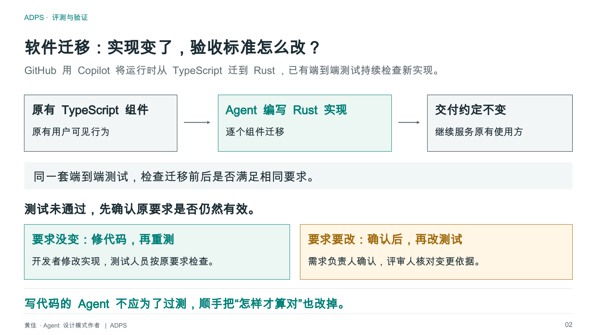
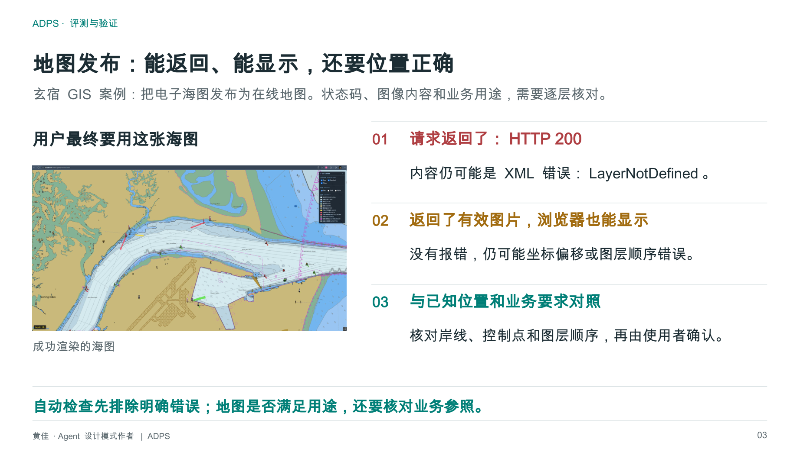
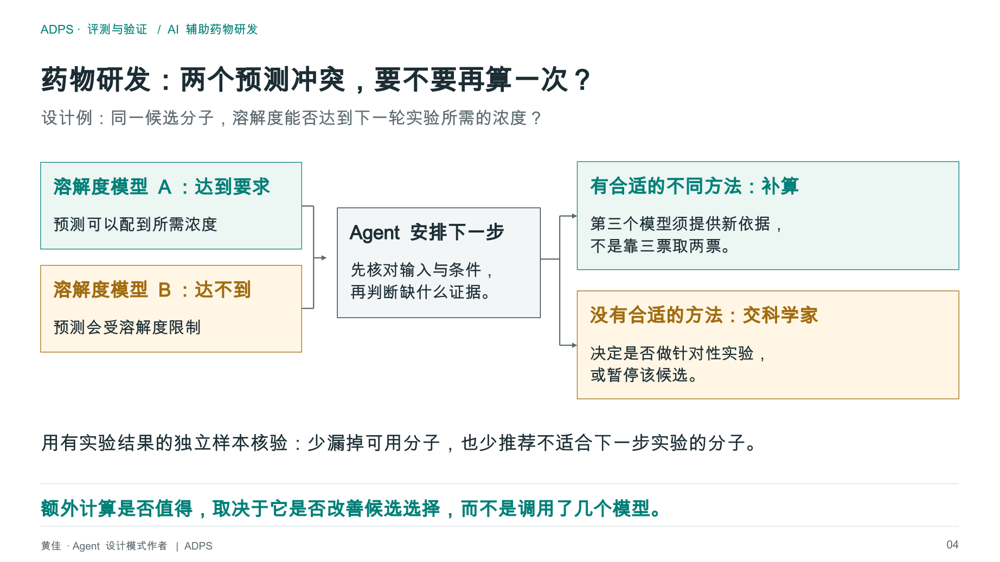
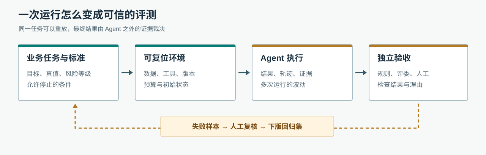
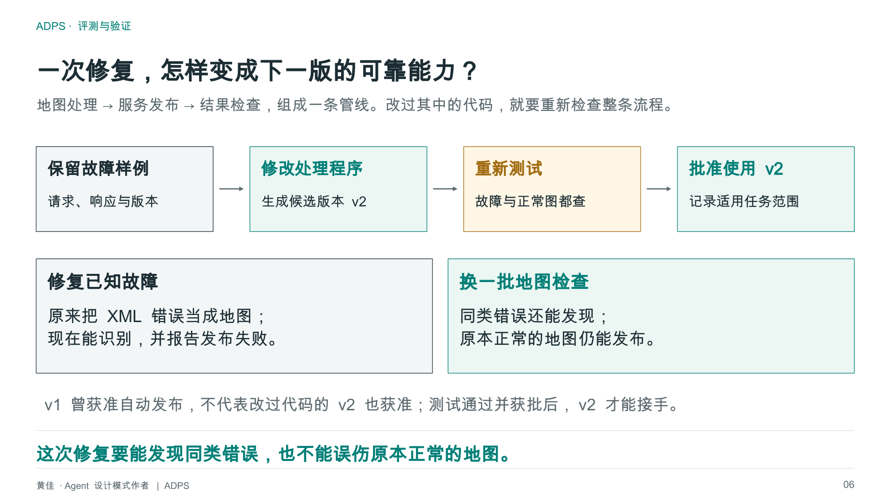

<a href="https://adpsagent.com/zh/workshops/">研讨会</a>/横切工程面 · 评测与验证

<header class="publication-head">

ADPS 设计模式系列研讨会

<h1>Agent 评测与验证研讨会</h1>

从任务是否完成，到业务结果是否正确；从一次跑通，到换模型、换环境以后还能否通过。

</header>

2026-09-29

<table class="workshop-roster"><thead><tr><th>角色</th><th>姓名</th><th>公开身份</th></tr></thead><tbody>
<tr><td>主持人</td><td>黄佳</td><td>ADPS 发起人，Manning《Designing AI Agents》作者</td></tr>
<tr><td>主持人</td><td>高飞</td><td>软件测试 Agent AUUO.ai 技术负责人，前快手、爱奇艺资深架构师</td></tr>
<tr><td>研讨嘉宾</td><td>赵丽坤</td><td>蚂蚁支付宝技术部质量专家</td></tr>
<tr><td>研讨嘉宾</td><td>张栋</td><td>腾讯专家工程师，悟空研发安全负责人</td></tr>
<tr><td>研讨嘉宾</td><td>黄湘龙</td><td>北京微念智能创始人，OpenLogos 与 RunLogos 作者</td></tr>
<tr><td>研讨嘉宾</td><td>张海立</td><td>《LangGraph 实战》《LangChain 实战》作者，LangChain 官方大使</td></tr>
<tr><td>研讨嘉宾</td><td>李博</td><td>高级工程师，规划设计院总工</td></tr>
<tr><td>组织</td><td>白萍萍</td><td>ADPS 秘书，AI 产研峰会主理人</td></tr>
</tbody></table>

两小时二十余分钟的讨论没有停在模型榜单。高飞先介绍评测任务怎样运行，再拿车机 GUI 测试说明公开基准与现场问题的距离；赵丽坤讲业务评测集和模型评委；张栋把稳定度、故障回流与生产发布连起来；黄湘龙打开 AI 驱动研发的测试账本和多模型评审流程；李博则用工程图纸审查说明，正确的结果有时是停止审查，等待资料补齐。

## 1. 先说清楚在评什么

黄佳开场时摆出三个工作现场。用 AI 辅助软件开发，要看需求有没有落实、改动是否通过独立验收；开发一个可反复执行任务的 Agent 产品，要看它换任务、换版本后的成功率；在药物研发中使用 Agent，计算跑完只是得到候选结论，科学判断还要看证据和后续实验。三件事都叫“评测”，但被评对象和最终裁判不同。

<figure class="workshop-diagram"><figcaption>软件迁移：实现变更和验收标准不能由同一条改动一起放行。点击查看原图。</figcaption></figure>

<figure class="workshop-diagram"><figcaption>GIS 发布：HTTP 200、页面能打开、地图正确，是三道不同的检查。图中的业务现场来自既有 GIS 案例。</figcaption></figure>

<figure class="workshop-diagram"><figcaption>科研任务：两个预测相左时，第三次计算是否值得做，取决于它能否帮助排除错误候选；计算次数本身不是成果。</figcaption></figure>

这里有一个贯穿全场的问题：如果只知道 Agent 输出了答案，没有独立的业务事实、可复位任务或人工复核，就不知道答案究竟对不对。

## 2. 高飞：先把任务、环境和验证器搭起来

高飞区分了公开榜单和企业自己的测试。他介绍了 <a href="https://github.com/open-compass/AgentCompass">AgentCompass</a> 对基准、Harness、模型和环境的解耦，以及 <a href="https://github.com/harbor-framework/harbor">Harbor</a> 对任务、运行环境、Agent 交互和验证结果的组织。框架可以帮助重复运行，但任务集仍要回答“这个产品应该完成什么”。他用 <a href="https://github.com/swe-bench/SWE-bench">SWE-bench</a> 的仓库问题、补丁和测试说明，软件修复可以有相对明确的通过条件；调研报告、GUI 操作等任务则还要检查引用、界面状态和中间步骤。

他的车机测试现场更具体。部分设备无法依赖调试接口输入和读取状态，于是测试 Agent 从摄像头画面识别屏幕，再通过机械臂操作。换一套车机界面，就要采集新的图标与页面图片，人工标注一部分数据，重新检验识别与操作能力。早期方案每输入一个字母都重新观察屏幕，功能虽能跑通，速度却无法满足测试需要；后来把键盘输入拆成连续操作，减少逐字观察。评测在这里不仅查“能否点击”，还暴露出方案的时延问题。

黄佳追问：报告、网站这类没有单一标准答案的成果，怎么比较新旧版本？高飞的回答是先定产品要完成的任务，再把可运行性、内容覆盖、引用真实性、风格等拆成检查项；失败样本还要标注卡在什么阶段。黄佳把讨论收束到一个实际工作：把模糊的交付要求转成可检查的任务和标准。标准写不清，评测框架再完整也无从裁决。

## 3. 赵丽坤：业务评测集不是一份通用试卷

赵丽坤介绍了消费端、商家端和内部运营等不同类型的智能体。功能、性能与首 Token 时间沿用软件测试的办法；回答是否符合业务，则需要按业务建评测集和评分标准。样本来自人工构造的典型问题、真实用户问题、线上失败案例和 AI 合成的问题。样本量不能脱离场景定：有的业务一百条能覆盖首批关键任务，有的要扩到更大规模。

她举了商品标签的例子。模型把商品判断成食品还是服饰，可以先由人标出一批正确答案，再用另一个模型批量评；当人和机器意见不一致时，回看样本与评分提示，修正评委。所谓 Judge Model 不是天然正确的裁判，它也需要对照人工标注校准。业务线越来越多时，共用平台能承接通用安全、多轮对话等横向测试，但每个业务仍要维护自己的场景和指标。

黄佳接着问，很多团队各自做 Agent，怎样管理？赵丽坤描述的是共享底座和按团队划分的管理方式。她也给业务效果留了余地：面向消费者的尝试尚难一概而论；部分面向企业的客服、策略或创意工作已有可观察的效率收益。这里不能把“上线了很多 Agent”直接写成“为业务创造了同等规模的价值”。

## 4. 张栋：先看终点，出问题再拆链路

张栋把评测的起点放在业务场景。以安全检测为例，先列最常见的几类问题，覆盖高频且高风险的任务，达到约定的上线线后再从线上失败案例补样本。安全场景关心漏了多少真实问题、报出的漏洞有多少是真的；换到质量或服务场景，指标就不应照搬。他反复强调，不能用一张通用榜单代替本地业务验收。

他提出的“黑盒”也不是不保存轨迹。第一次先检查端到端结果；若结果符合业务要求，暂时无需把每个内部步骤都变成独立评测项目。一旦结果不对，再把检测、执行和验证等环节拆开，定位是哪一步丢了证据或做错了判断。高飞随后追问指标如何贴近真实任务，张栋补了模型时代的一项指标：**稳定度**。同一任务、同一模型与配置多跑几次，漏洞有时查出、有时漏掉；只报一次准确率会把这种波动藏掉。版本更新后也要重跑旧场景，不能默认新模型全面优于旧模型。

讨论进一步落到发布权。Agent 可以在开发环境生成用例、分析失败、提出规则修改；会直接影响线上拦截或客户业务的改动，仍由人检查证据和放行。交叉模型复核能帮助发现单一模型的盲点，却不能自动替代生产责任人。

## 5. 黄湘龙：让 AI 写软件，也要测试评测设施

黄湘龙介绍 OpenLogos 与 RunLogos 中的研发流程：需求拆成场景，场景关联测试用例，代码和测试围绕用例 ID 展开；每轮测试把结果写入结构化账本，验收时按 ID 逐项核对。大任务分成小片，每片先测试，再进入下一片，最后做全量回归。测试不通过或账本损坏时，流程停下等待人处理。

他用一个模型开发、另一个模型评审。评审意见须标出代码位置、严重程度和修复依据；开发方逐条答复已修复、驳回或暂缓。没有轮次上限，评审会不断找到更细的小问题，于是流程设置发现问题与收敛处理的阶段，无法裁决的高风险问题交给人。

最值得警惕的是“看起来认真”的过度设计：Agent 没读透旧代码，为一个新需求又建缓存、事件源或流控机制。评审因此先查现有实现，要求指出可复用代码；修一个缺陷时，还要问原来的机制是否仍有必要。黄湘龙补充，评测设施自己也会出错：测试代码、结果账本和评审规则要有各自的测试。用例逐渐增多以后，每个小改动都跑全量测试会拖慢研发，还要分层或并行安排回归。

## 6. 李博：图纸审查中，“暂停”可能是正确答案

李博从规划设计院的工作讲起。最早的工具是协助一个专业的总工审图；后来要让多个专业围绕同一工程事实提出意见、核对冲突。他并不要求所有任务有同一个自动化比例：高风险问题留给人，中低风险的资料检查和规则提示可以逐步交给系统。

一个测试任务是审查大型工程项目前，检查地勘等先决资料。资料缺了，正确行为不是编造审查结论，而是停止正式审查、指出缺什么、等待补齐。这个例子改变了“成功 = 始终给出答案”的评测直觉。到了 Skill、单专业 Agent、多专业 Agent 三个阶段，评测对象也变了：方法是否帮助审图、专业任务能否完成、跨专业意见能否一致。李博提醒，团队要保留真实工程任务，避免系统只会做固定试卷。他还解释，某些图纸场景中使用图片或 PDF 比直接处理 CAD/BIM 更便于现阶段的模型读取；选择输入格式同样会影响验收。

## 7. 从讨论形成的工程检查表

<figure class="workshop-diagram"><figcaption>根据本次讨论整理的评测闭环示意，不是某位嘉宾的系统截图。</figcaption></figure>

<table><thead><tr><th>要写清的事</th><th>本次讨论给出的检查方式</th></tr></thead><tbody>
<tr><td>任务与结果</td><td>谁的任务？正确答案、允许的停止条件和风险等级分别是什么？</td></tr>
<tr><td>运行条件</td><td>任务数据、环境、模型、Harness、工具与预算能否记录并重放？</td></tr>
<tr><td>裁判</td><td>程序、业务规则、模型评委和人各判什么？评委如何用人工样本校准？</td></tr>
<tr><td>版本比较</td><td>只改一个主要变量时，新旧版本的质量、稳定度、成本和时延如何变化？</td></tr>
<tr><td>发布与回流</td><td>哪些失败进入回归集？哪些线上改动必须由人复核？</td></tr>
</tbody></table>

张海立在问答中补充了框架视角：现成 Coding Agent 的组织方式，与基于 LangGraph 等框架开发自有 Agent 产品，是两类不同的构建路径；运行时可观测的接法也不同。两类产品最终仍要回答同一个问题：任务、环境和验证口径是什么。具体框架的取舍超出本场范围，后续另议。

## 8. 与 ADPS 现有内容的关系

- [X2 评测与验证](https://adpsagent.com/zh/patterns/x2-evals-and-testing/)记录横切工程要求；本场讨论补进业务真值、评委校准、重复稳定度、评测设施自身的测试与生产放行边界。
- [评测与测试专题](https://adpsagent.com/zh/topics/agent-evals-and-testing/)可继续收纳分领域的评测任务、数据集和验证器做法；本页保留现场讨论的来龙去脉。
- [GIS 发布案例](https://adpsagent.com/zh/cases/xuanxu-gis-agent/)提供“接口成功但地图错误”的具体项目背景；[反思模块](https://adpsagent.com/zh/patterns/reflection/)讨论失败如何变成下一版能力。

还没有在本场得到统一答案的问题包括：长程任务中断后怎样复位，多模型互审时怎样量化评委质量，以及评测集更新由谁批准。它们值得在后续的领域实例里继续验证。

<figure class="workshop-diagram"><figcaption>开场 PPT v0.4 的收束图：一次故障修好了，不代表下一类任务也会正确；要把样本和验收条件留在回归集中。</figcaption></figure>

本页依据 2026-09-29 会议逐字稿整理，姓名与公开身份采用嘉宾提供的口径；内部项目细节作了脱敏。开场图取自黄佳当晚使用的 PPT v0.4，新增示意图为会后整理。

<!-- PAGE-CHRONICLE:START -->
<section aria-labelledby="page-chronicle-title" class="page-chronicle">
<h2 id="page-chronicle-title">溯源记录</h2>
<dl>

<dt>来源记录</dt><dd>Agent 评测与验证研讨会；会议日期 <time datetime="2026-09-29">2026-09-29</time></dd>

<dt>来源日期</dt><dd><time datetime="2026-09-29">2026-09-29</time></dd>

<dt>本页首次公开</dt><dd><time datetime="2026-09-30">2026-09-30</time></dd>

</dl>

<a href="https://adpsagent.com/zh/chronicle/">查看 ADPS 来源时间线</a>

</section>
<!-- PAGE-CHRONICLE:END -->
