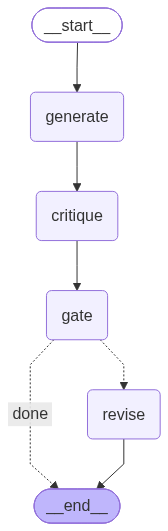

# Generator-Critic — LangGraph Implementation

> "The model critiques; the harness decides."

This notebook implements Generator-Critic as a **LangGraph `StateGraph`**:

`generate -> critique -> gate -> optional revise -> END`

The graph version is intentionally explicit. Every role is a node, the policy branch is a conditional edge, and the revision path is visible in the rendered graph. The [LangChain version](../langchain/tutorial.ipynb) implements the same data and policy as LCEL runnables.

Everything runs against deterministic fake roles first (no API key needed), then the real backend. Default: AI Studio + `ernie-5.1` (OpenAI-compatible). See [`.env.example`](../../../.env.example) for provider config and [`model_config.py`](../../../model_config.py) for the shared loader.

## What this pattern does

Generator-Critic separates three jobs that often get blurred together:

1. **Generate** the artifact under review.
2. **Critique** the artifact as structured evidence: score, summary, issues.
3. **Gate** the artifact in deterministic code.

The key design choice: **revision is not acceptance**. If the critic finds a blocker or the score is too low, this pass may draft a revision, but it ends as `needs_revision`. The revised artifact must go through a fresh critique before it can pass.

| | `langgraph/` (StateGraph) | `langchain/` (LCEL) |
|---|---|---|
| **The roles are** | Explicit nodes: `generate`, `critique`, `gate`, `revise` | Runnables: generator pipe, critic pipe, policy runnable |
| **The branch is** | `add_conditional_edges("gate", ...)` | Code inside a `RunnableLambda` gate |
| **Mock roles** | Plain Python callables from `shared.py` | `FakeListChatModel` responses in call order |
| **Safety boundary** | Revision path ends at `END` | Same: no auto-accept after revision |
| **Trade-off** | More code, every transition visible | Less code, control flow implicit |


## Setup

The mock cells are deterministic and need no API key. The real-backend section at the end calls `get_model()` directly; when no model is configured, it skips with a short message.


```python
from __future__ import annotations

import sys
from pathlib import Path
from typing import Callable, TypedDict

# shared.py lives in the pattern folder; model_config.py and nbtools.py live at
# the repo root. Search upward for each marker so this notebook works from
# JupyterLab, nbmake, nbconvert, or the repo root without brittle ../../ paths.
for _marker in ("shared.py", "model_config.py", "nbtools.py"):
    _dir = next(p for p in (Path.cwd(), *Path.cwd().parents) if (p / _marker).exists())
    sys.path.insert(0, str(_dir))

from langchain_core.messages import HumanMessage, SystemMessage
from langgraph.graph import END, START, StateGraph

from model_config import get_model
from nbtools import show_graph
from pattern import Artifact, ChainResult, Critique, Decision
from shared import (
    BAD_CRITIQUE_JSON,
    CRITIC_SYSTEM_PROMPT,
    DEFAULT_PROMPT,
    GENERATOR_SYSTEM_PROMPT,
    GOOD_CRITIQUE_JSON,
    LOW_SCORE_CRITIQUE_JSON,
    NEEDS_REVISION_CRITIQUE_JSON,
    OPINION_ONLY_CRITIQUE_JSON,
    default_policy,
    parse_critique_json,
    print_trace,
    revise_with_evidence,
    scripted_critic,
    scripted_generator,
)
```

## State and role interfaces

The graph keeps the review boundary visible in state:

- `artifact` is the exact version submitted to the critic.
- `revision_draft` is an optional replacement produced after the decision.
- `critique`, `decision`, and `trace` form the audit record.

`build_graph(generator, critic, ...)` starts from a prompt. Passing `generator=None` starts an explicit review pass from an existing `artifact`; it never disguises a second review as generation.


```python
class ReviewState(TypedDict, total=False):
    prompt: str
    artifact: Artifact
    revision_draft: Artifact
    critique: Critique
    decision: Decision
    trace: list[str]


GeneratorFn = Callable[[str], Artifact]
CriticFn = Callable[[Artifact], Critique]
ReviserFn = Callable[[Artifact, Critique], Artifact]
```

## Core nodes

Each node owns exactly one role. `generate` starts a prompt-driven pass; `receive` starts an explicit re-review from an existing artifact. Both converge on `critique`. The critic records grounded evidence and any dropped opinions, the deterministic gate decides, and `revise` writes only `revision_draft`.

The conditional edge after `gate` is the safety boundary. `revise` ends at `END`, so the graph cannot accept text that its critic never saw.


```python
def build_graph(
    generator: GeneratorFn | None,
    critic: CriticFn,
    reviser: ReviserFn | None = None,
    *,
    policy=None,
):
    policy = policy or default_policy()

    def generate_node(state: ReviewState) -> dict:
        artifact = generator(state["prompt"])
        return {"artifact": artifact, "trace": ["generated"]}

    def receive_node(_state: ReviewState) -> dict:
        # A review-only pass records its own entry event; callers provide only
        # the artifact and cannot accidentally omit the audit boundary.
        return {"trace": ["artifact_received"]}

    def critique_node(state: ReviewState) -> dict:
        critique = critic(state["artifact"])
        trace = state["trace"] + ["critiqued"]
        if critique.dropped_issues:
            trace.append(f"dropped_opinions:{len(critique.dropped_issues)}")
        return {"critique": critique, "trace": trace}

    def gate_node(state: ReviewState) -> dict:
        # The critic provides evidence; AcceptancePolicy owns the decision.
        decision = policy.decide(state["critique"])
        return {"decision": decision, "trace": state["trace"] + [decision.value]}

    def revise_node(state: ReviewState) -> dict:
        if reviser is None:
            return {}
        # Do not overwrite the reviewed artifact. The replacement remains an
        # unreviewed draft when this bounded graph pass reaches END.
        revision_draft = reviser(state["artifact"], state["critique"])
        return {
            "revision_draft": revision_draft,
            "trace": state["trace"] + ["revision_drafted"],
        }

    def route_after_gate(state: ReviewState) -> str:
        if state["decision"] is Decision.NEEDS_REVISION and reviser is not None:
            return "revise"
        return "done"

    builder = StateGraph(ReviewState)
    if generator is None:
        builder.add_node("receive", receive_node)
        builder.add_edge(START, "receive")
        builder.add_edge("receive", "critique")
    else:
        builder.add_node("generate", generate_node)
        builder.add_edge(START, "generate")
        builder.add_edge("generate", "critique")
    builder.add_node("critique", critique_node)
    builder.add_node("gate", gate_node)
    builder.add_node("revise", revise_node)
    builder.add_edge("critique", "gate")
    builder.add_conditional_edges("gate", route_after_gate, {"revise": "revise", "done": END})
    builder.add_edge("revise", END)
    return builder.compile()


def result_from_state(state: ReviewState) -> ChainResult:
    return ChainResult(
        decision=state["decision"],
        reviewed_artifact=state["artifact"],
        critique=state["critique"],
        revision_draft=state.get("revision_draft"),
        trace=tuple(state["trace"]),
    )
```

## Deterministic fake roles

LangGraph does not require a LangChain model object. The graph only needs callables matching `GeneratorFn` and `CriticFn`, so the mock roles stay plain Python:

- `scripted_generator(prompt)` returns the canned artifact.
- `scripted_critic(raw_json)` returns a critic callable that replays one JSON payload through the shared parser.

That mirrors the guidance in `REFERENCE_IMPL.md`: use `FakeListChatModel` for LangChain LCEL pipes, but keep LangGraph fakes framework-agnostic when the graph accepts bare callables.


```python
accepted_graph = build_graph(
    scripted_generator,
    scripted_critic(GOOD_CRITIQUE_JSON),
    reviser=revise_with_evidence,
)
show_graph(accepted_graph, alt="Generator-Critic LangGraph")

```





## Mock run 1: clean critique accepts

The generator returns the incident update and the critic returns a high score with no issues. The gate accepts. The trace is short because each graph node appends exactly one event.


```python
state = accepted_graph.invoke({"prompt": DEFAULT_PROMPT})
print_trace(result_from_state(state))

```

    decision: accepted
    trace: generated -> critiqued -> accepted
    score: 0.9
    score evidence: none
    issues: none
    dropped: none
    reviewed artifact: We identified elevated checkout errors. Impact is limited to card payments. Next update in 30 minutes.


## Mock run 2: a revision draft needs an explicit second review

The blocker routes pass 1 through `revise`, which stores a separate draft and ends. Pass 2 builds a review-only graph (`generator=None`) and submits that draft directly to the critic. Only this new decision can accept revision 1.


```python
revision_graph = build_graph(
    scripted_generator,
    scripted_critic(NEEDS_REVISION_CRITIQUE_JSON),
    reviser=revise_with_evidence,
)
first_state = revision_graph.invoke({"prompt": DEFAULT_PROMPT})
first_pass = result_from_state(first_state)
print("pass 1")
print_trace(first_pass)

second_review_graph = build_graph(None, scripted_critic(GOOD_CRITIQUE_JSON))
second_state = second_review_graph.invoke({"artifact": first_pass.revision_draft})
print()
print("pass 2")
print_trace(result_from_state(second_state))
```

    pass 1
    decision: needs_revision
    trace: generated -> critiqued -> needs_revision -> revision_drafted
    score: 0.74
    score evidence: incident policy requires a cited status incident
    issues: ['blocker:incident_policy:sentence 2:impact claim lacks a cited source']
    dropped: none
    reviewed artifact: We identified elevated checkout errors. Impact is limited to card payments. Next update in 30 minutes.
    revision draft (unreviewed): We identified elevated checkout errors. Impact is limited to card payments. Next update in 30 minutes. Evidence: status dashboard incident INC-42.

    pass 2
    decision: accepted
    trace: artifact_received -> critiqued -> accepted
    score: 0.9
    score evidence: none
    issues: none
    dropped: none
    reviewed artifact: We identified elevated checkout errors. Impact is limited to card payments. Next update in 30 minutes. Evidence: status dashboard incident INC-42.


## Mock run 3: low score without blockers still fails

Here the critic returns only a warning, but the score is below the default threshold. This demonstrates that the policy is more than a blocker check: score and issue severity both matter.


```python
low_score_graph = build_graph(
    scripted_generator,
    scripted_critic(LOW_SCORE_CRITIQUE_JSON),
    reviser=revise_with_evidence,
)
state = low_score_graph.invoke({"prompt": DEFAULT_PROMPT})
print_trace(result_from_state(state))

```

    decision: needs_revision
    trace: generated -> critiqued -> needs_revision -> revision_drafted
    score: 0.62
    score evidence: support style rubric requires a concrete update window
    issues: ['warning:support_style_guide:sentence 3:next update timing is too vague']
    dropped: none
    reviewed artifact: We identified elevated checkout errors. Impact is limited to card payments. Next update in 30 minutes.
    revision draft (unreviewed): We identified elevated checkout errors. Impact is limited to card payments. Next update in 30 minutes. Evidence: status dashboard incident INC-42.


## Mock run 4: unsupported opinions cannot block

The critic labels a style preference as a blocker but provides no evidence. The critique retains it in `dropped_issues` for audit, while the policy accepts the artifact because unsupported opinions are not control signals.


```python
opinion_graph = build_graph(
    scripted_generator,
    scripted_critic(OPINION_ONLY_CRITIQUE_JSON),
)
state = opinion_graph.invoke({"prompt": DEFAULT_PROMPT})
print_trace(result_from_state(state))
```

    decision: accepted
    trace: generated -> critiqued -> dropped_opinions:1 -> accepted
    score: 0.92
    score evidence: none
    issues: none
    dropped: ['blocker:style_preference:body:the update feels too terse']
    reviewed artifact: We identified elevated checkout errors. Impact is limited to card payments. Next update in 30 minutes.


## Mock run 5: malformed critic output fails closed

The critic returns invalid JSON. The shared parser converts that failure into an evidence-backed parser blocker, so the graph takes the revision branch instead of accidentally accepting the artifact.


```python
parse_failure_graph = build_graph(
    scripted_generator,
    scripted_critic(BAD_CRITIQUE_JSON),
    reviser=revise_with_evidence,
)
state = parse_failure_graph.invoke({"prompt": DEFAULT_PROMPT})
print_trace(result_from_state(state))

```

    decision: needs_revision
    trace: generated -> critiqued -> needs_revision -> revision_drafted
    score: 0.0
    score evidence: critic output failed schema validation
    issues: ['blocker:parser:critic:critic output could not be parsed: JSONDecodeError: Expecting property name enclosed in double quotes: line 1 column 2 (char 1)']
    dropped: none
    reviewed artifact: We identified elevated checkout errors. Impact is limited to card payments. Next update in 30 minutes.
    revision draft (unreviewed): We identified elevated checkout errors. Impact is limited to card payments. Next update in 30 minutes. Evidence: status dashboard incident INC-42.


## Real backend

The live run uses the same graph shape. We swap fake role callables for real role callables, then pass them to `build_graph`:

- fake: `build_graph(scripted_generator, scripted_critic(...))`
- real: `build_graph(real_generator, real_critic)`

`get_model()` is the only boundary. If no provider key is configured, it returns `None` and the cell skips. For deterministic notebook verification, run tests with provider API keys unset rather than adding a notebook-specific fake/real mode flag.


```python
model = get_model()

if model is None:
    print("No model configured — skipping real backend run. See .env.example to enable.")
else:
    def real_generator(prompt: str) -> Artifact:
        response = model.invoke([
            SystemMessage(content=GENERATOR_SYSTEM_PROMPT),
            HumanMessage(content=prompt),
        ])
        return Artifact(content=str(response.content), metadata={"source": "real_model"})

    def real_critic(artifact: Artifact) -> Critique:
        response = model.invoke([
            SystemMessage(content=CRITIC_SYSTEM_PROMPT),
            HumanMessage(content=f"Artifact under review:\n{artifact.content}"),
        ])
        return parse_critique_json(str(response.content))

    try:
        real_graph = build_graph(real_generator, real_critic)
        state = real_graph.invoke({"prompt": DEFAULT_PROMPT})
        print_trace(result_from_state(state))
    except Exception as exc:  # noqa: BLE001
        # Provider outages, auth failures, and rate limits are reported instead
        # of crashing the tutorial. Parser failures still fail closed inside the
        # graph and show up as a needs_revision result.
        print(f"Real backend failed gracefully: {type(exc).__name__}: {exc}")

```

    Model: ernie:ernie-5.1


    decision: needs_revision
    trace: generated -> critiqued -> needs_revision
    score: 0.35
    score evidence: Missing critical incident communication elements per standard incident update rubric: no timeline, no root cause, no impact scope, no incident ID, no specific remediation steps, no verification of resolution, and vague empathetic language.
    issues: ['blocker:Incident communication best practices (timeline transparency):Body paragraph 1:No incident timeline provided (start time, duration, resolution time)', 'blocker:Incident post-mortem standards (root cause disclosure):Body paragraph 2:No root cause or technical explanation of the failure', 'blocker:Incident impact reporting standards:Body paragraph 1:No quantified impact scope (number of affected customers, transactions, revenue)', 'blocker:Incident management documentation standards:Header/Subject line:No incident identifier or reference number for tracking', 'blocker:Incident communication completeness checklist:Body paragraph 3:Remediation steps are vague and non-specific', 'warning:Customer communication tone guidelines:Opening and closing:No explicit apology or acknowledgment of customer impact', 'warning:Communication readiness check:Body paragraph 4:Contact information is a placeholder, not actual details', 'warning:Incident resolution verification standards:Body paragraph 2:No mention of monitoring or verification that the fix is holding']
    dropped: none
    reviewed artifact: **Subject**: Checkout System Update – Issue Resolved
    Dear Valued Customer,
    - We experienced a technical issue with our checkout system earlier today, which may have prevented some customers from completing their purchases.
    - Our team has resolved the issue, and the system is now fully operational.
    - We are taking steps to prevent this from happening again.
    - If you encountered any issues, please contact our support team at [support email/phone] for assistance.
    Thank you for your patience.
    Sincerely,
    [Your Company Name]


## Composing as a subgraph

A compiled Generator-Critic graph is a normal LangGraph runnable. A larger agent could route only high-risk outputs through this reviewer before releasing them:

```python
parent = StateGraph(AgentState)
parent.add_node("draft", draft_node)
parent.add_node("generator_critic", accepted_graph)  # compiled graph as a node
parent.add_conditional_edges("draft", route_if_review_needed, {
    "review": "generator_critic",
    "skip": END,
})
```

That composition point is why the revision boundary matters. If `generator_critic` returns `needs_revision`, the parent graph can send it to an editor, queue it for human review, or run a second pass explicitly.

## What to remember

- `StateGraph` makes the safety boundary visible: `generate -> critique -> gate -> revise -> END`.
- The result keeps the reviewed artifact separate from any unreviewed revision draft.
- Passing `generator=None` creates an explicit second review instead of silently regenerating.
- Unsupported opinions stay in the audit trail but cannot drive policy.
- Parser failures fail closed as grounded blocker critiques.

## Further reading

- [LangChain version](../langchain/tutorial.ipynb) — same pattern as LCEL pipes and a runnable policy gate
- [Pattern README](../README.md) — design rationale and Python core implementation
- [Reference implementation guide](../../../REFERENCE_IMPL.md) — repo conventions, fake-model guidance, notebook verification commands
- [StateGraph reference](https://langchain-ai.github.io/langgraph/reference/graphs/)
